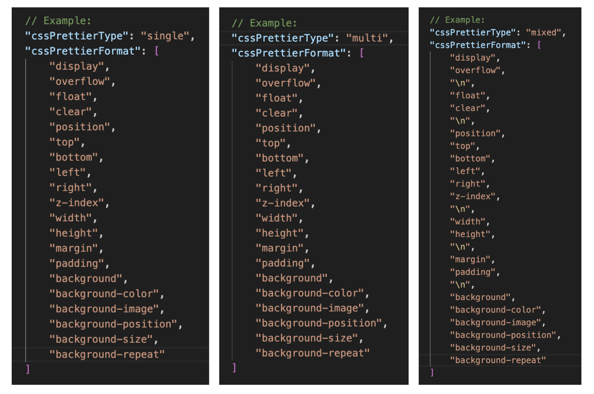
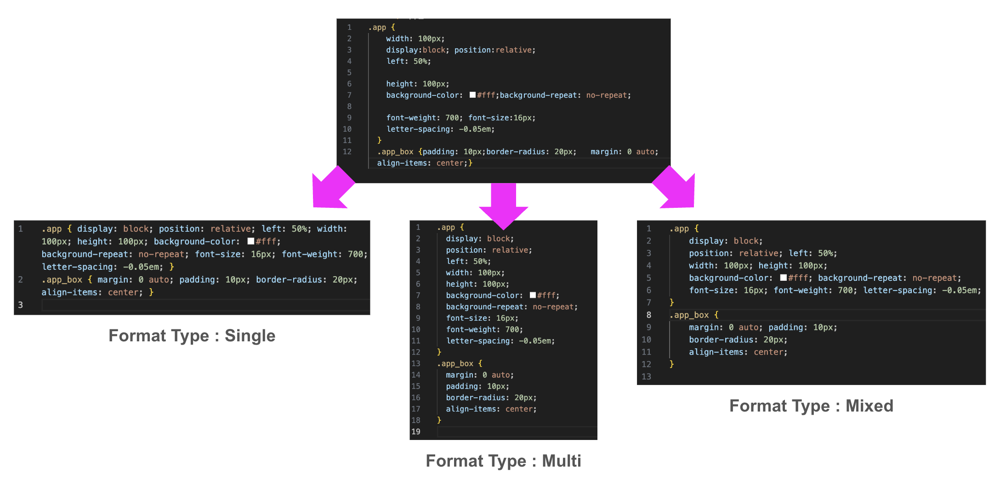

    <h1>
		코드를 빠르고 깔끔하게 정리해주는 
		커스텀 CSS 자동 정렬 도구
	</h1>
	<strong>✨ 단 한번의 타이핑으로 CSS 스타일 완벽 정리</strong> 
	<strong>🛠️ 개발 효율성을 높이는 동일한 포맷의 CSS 스타일</strong>

## 기획 배경

CSS 코딩 컨벤션(스타일 가이드)이 없는 회사에선 CSS를 작성할 때 스타일 순서 지정 없이 한 줄 코딩이나 여러 줄 코딩(모든 속성 줄 바꿈)으로 규칙을 정해놓고 해당 규칙을 따르는 방법으로 작업을 진행합니다([그림1 참고](#사용-방법)).

이런 프로젝트는 작업 인원 변동과 실시간 수정 사항 반영이 있을 때 minor 한 수정을 위해서 모든 스타일을 읽어야 하는 문제에 직면하게 됩니다.

코딩 컨벤션의 필요성을 느낀 회사는 급하게 코딩 컨벤션 작업을 하지만, 작업자와 협의 및 설득, 그리고 새로운 작업환경에 적응할 시간이 필요합니다.

하지만 작업자는 짧은 시간 내 신규 프로젝트와 추가 수정 사항을 대응하느라 시간이 없습니다😢

이럴 때 **커스텀 CSS 자동 정렬 도구**를 사용하면 개발 효율성을 높일 수 있습니다🎉

## 데모 영상

- `settings.jsonc` 내 원하는 `cssPrettierType` 과 `cssPrettierFormat` 을 설정 후 CSS 파일 저장 시 ❗️폴더 내 모든 CSS 파일이 아닌❗️ 해당 파일만 적용 됩니다. 

## 기능 정의

- `cssPrettierType`
	- `single` : 모든 스타일 선언을 한 줄에 배치합니다. 스타일 시트를 간결하게 유지하려는 경우에 적합합니다.
	- `multi` : 각 스타일 선언을 새로운 줄에 배치하고, 들여쓰기를 추가하여 시각적 구분을 강화합니다. 복잡한 스타일 블록에 유용합니다.
	- `mixed` : 줄바꿈을 선택적으로 삽입하여, 일부 선언은 강조하고 나머지는 간결하게 처리합니다.

- `cssPrettierFormat`
	- 스타일 정렬 순서를 지정합니다. 
	- 지정되지 않은 스타일은 마지막에 배치됩니다. 
	- `mixed` 타입에서는 줄바꿈을 위해 `\n`을 추가하세요. ( `single` / `multi` 타입에서는 `\n` 정상 동작 하지 않습니다 🙅‍♀️ )

	
## 사용 방법
1. `settings.jsonc` 파일 내 가이드에 따라 원하는 스타일을 지정해주세요.

2. 자동 정렬을 원하는 CSS 파일에서 `Ctrl+S` / `Cmd+S` 키를 사용하여 파일 자동 정렬 및 저장해주세요.

## 추후 구현 사항

- CSS 파일만 변환되지만 SCSS 파일도 적용 대상에 추가할 예정입니다🙆‍♀️